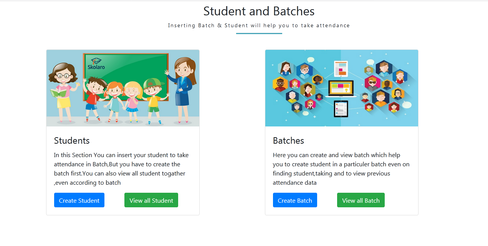

<h1 align="center">Attendance Management system</h1>

Its an attendance management system which could be used by any School / Collage/University/Office to take,view attendace and many more

## Project Description

### Suppose a school has 10 classes from 1-10 and each class could have more than two batches.By useing this application any one is able to take online attendace of each batch of all classes and this attendance history would be stored on database according to date.First of all admin have to create batches according to classes.After that admin is able to insert student in that batch and lastly the system is ready to take attendance.Admin is also able see all the sudents of all batches.Admin can view the attendance of a spacific batch in a spacific date.

## Design

- HTML5 
- CSS3 
- Bootstrap 

## Development

-  OOP PHP
-  Mysql

# How to use this application

-  Import attendance.sql in your database which you will find easyly on Database folder 
-  if you are on live server ,import all files on your Domain 
-  if you are on local server[Xampp Server] ,put all files on htdocs Folder [c/xampp] 
-  System is ready to use

# Contact & social

- **[Facebook](https://www.facebook.com/safahait.sawon)**
- **[Github](https://github.com/Safayet-Shawn/)**
- **[Gmail:safayetshawn95@gmail.com](safayetshawn95@gmail.com)**
- **[Phone :01726681903](01726681903)**
 
# Screenshots

